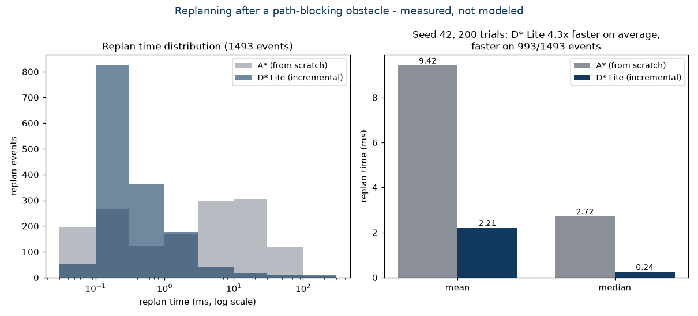
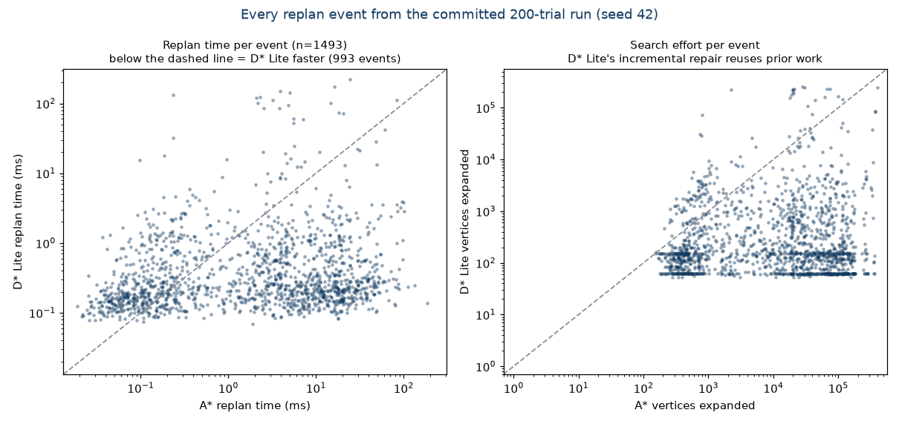
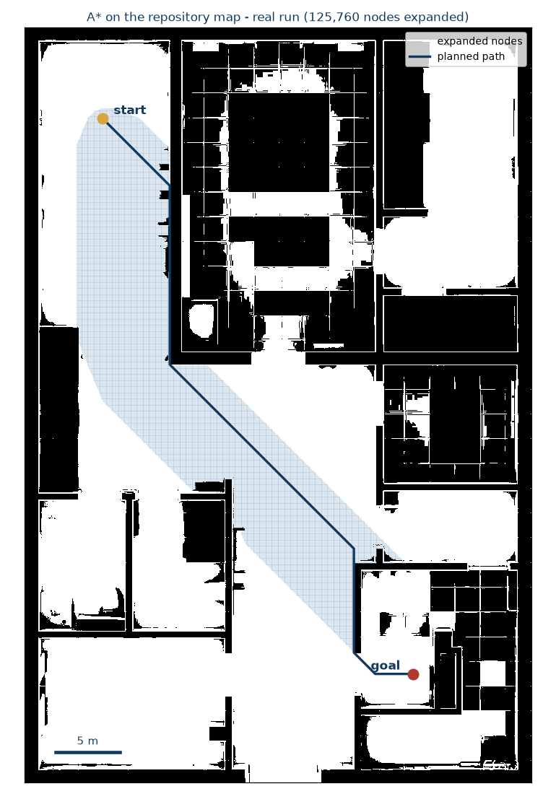
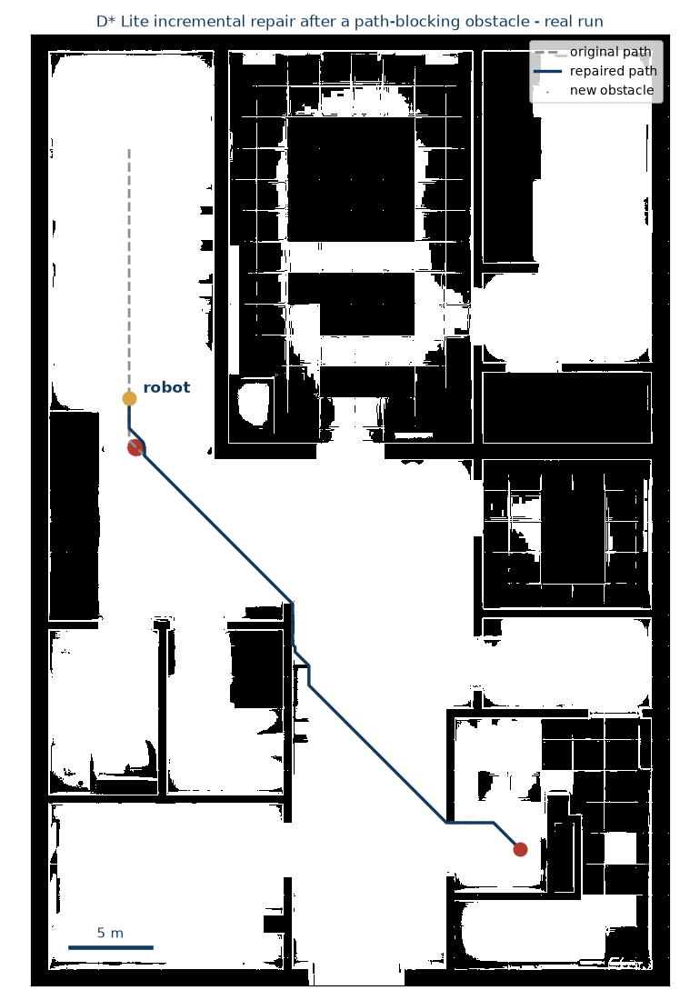

# ROS 2 Dynamic Path Planning
**A* vs D* Lite Global Planners for Nav2 - Incremental Replanning, Measured Honestly**

[](https://github.com/munawarkazmi/ros2-dynamic-path-planning/actions/workflows/ci.yml)
[](https://docs.ros.org/en/humble/)
[](LICENSE)
[](https://en.cppreference.com/w/cpp/20)

A* and D* Lite implemented as a ROS-free C++20 core with Nav2 plugin adapters,
plus a seeded benchmark of the event D* Lite exists for: **a path-blocking
obstacle appears mid-route and the planner must recover**.

## Measured results (seed 42, 200 trials, 1,493 replan events)

| | initial plan (mean) | replan mean | replan median | expansions / replan |
|---|---|---|---|---|
| **A\*** (from scratch) | 12.2 ms | 9.42 ms | 2.72 ms | 41,298 |
| **D\* Lite** (incremental) | 33.3 ms | **2.21 ms** | **0.245 ms** | **3,679** |

- D* Lite replans **4.3x faster on average** (**11x on the median**) and is
  faster on **993 / 1,493** replan events.
- Every event is validated: both planners optimize the same exact cost metric,
  and their path costs matched on **all 1,716 measurements** - the comparison
  is between two *optimal* planners, not a fast-but-wrong one and a slow-but-right one.
- The honest trade-off: D* Lite pays a ~2.7x more expensive initial search and
  loses trivial replans where its repair bookkeeping exceeds a short corridor
  re-search. It dominates exactly where it matters - the expensive replans that
  cause CPU spikes and hesitation on a real robot.



Per-event structure of the same run - every one of the 1,493 replans as a
point. D* Lite's repair cost stays in a narrow band regardless of how
expensive the from-scratch search is, which is the algorithm's entire value
proposition; the events above the diagonal are the honest flip side (trivial
replans where its bookkeeping loses):



Full per-event data: [reports/results/replan_benchmark.csv](reports/results/replan_benchmark.csv),
produced by [core/benchmark/benchmark_main.cpp](core/benchmark/benchmark_main.cpp) with
`--trials 200 --seed 42` on this repository's map (g++ -O2, WSL2 / Ubuntu 26.04).
Rerunning with the same seed reproduces the same scenarios; timings vary with hardware.

### The scenario, from real runs

Both figures below are actual algorithm output on the repository's occupancy map
(784 x 1168 cells at 0.05 m = 39.2 m x 58.4 m indoor floor plan), rendered by
[core/tools/render_figures.py](core/tools/render_figures.py) from data dumped by
[core/tools/dump_scenario.cpp](core/tools/dump_scenario.cpp).

**A global plan across the building.** A* expands 125,760 nodes (blue cloud) to
find this 919-cell path.



**Someone steps into the route.** D* Lite repairs the same journey around the
new obstacle by expanding just **256** vertices - reusing everything from its
previous search that is still valid.



## Plain-language guide

For a non-specialist reader there is a five-page guide,
[docs/explainer/explainer.pdf](docs/explainer/explainer.pdf), which explains
what replanning costs, why repair beats rebuilding on the expensive events
and loses on the trivial ones, and how the floating-point key-tie bug was
caught. Its source is committed alongside it and builds with `latexmk -pdf
explainer.tex`.

## Benchmark methodology

Per trial: a random reachable start/goal pair is sampled (seeded RNG, min 15 m
apart). Both planners produce an initial plan. Then, for each of 8 events, the
simulated robot advances along the current path, a 0.3 m-radius obstacle
appears further ahead **on the path** (guaranteeing the change matters), and
both planners replan from the same position on the byte-identical map:

- **A\*** replans from scratch - the standard Nav2 behavior.
- **D\* Lite**'s timed workload includes absorbing every changed cell via
  `updateCell()` *and* repairing its previous search.

Measurement order alternates per event to cancel cache-warmth effects. Each
event asserts both planners return equal-cost paths; the benchmark exits
nonzero on any mismatch (also enforced in CI on every push).

## Correctness

The planners use an exact integer cost metric (straight = 70, diagonal = 99,
scaled by the costmap cell cost) rather than floating-point sqrt(2). This is
not cosmetic: D* Lite's priority keys routinely tie between vertices, and
floating-point representations of mathematically equal keys differ by ulps,
which can leave stale search state frozen in the solution. Integer costs make
every comparison exact. [core/tests/test_planners.cpp](core/tests/test_planners.cpp)
validates against a reference Dijkstra with exact equality:

- A* and D* Lite initial plans are cost-optimal on randomized maps,
- D* Lite incremental replans after batched random edits (block / unblock /
  reprice) exactly match from-scratch results,
- replans from a moving start stay optimal (exercising the `km` machinery),
- an incremental replan after a local change expands far fewer vertices than a
  fresh search - the algorithm's reason to exist, asserted in CI.

On top of the unit tests, [core/tests/fuzz_planners.cpp](core/tests/fuzz_planners.cpp)
fuzzes the incremental machinery across eight scenario modes (every combination
of cost repricing, batched edits, and a moving start) x 3,000 seeds:
**23,748 scenarios and 185,237 incremental replans, each checked against
Dijkstra with exact equality, 0 failures**. The run is deterministic, so those
counts reproduce exactly via `make -C core fuzz` (also run in CI), which writes
them to [reports/results/fuzz_summary.txt](reports/results/fuzz_summary.txt) so
the figures quoted here can be checked against a record rather than taken on
trust. This is the harness that originally caught the floating-point key-tie
bug described above.

## Quick start - core (no ROS required)

```bash
git clone https://github.com/munawarkazmi/ros2-dynamic-path-planning.git
cd ros2-dynamic-path-planning
pip install pillow
python3 core/tools/png_to_pgm.py maps/indoor_grid.png maps/indoor_grid.pgm
make -C core test          # Dijkstra-validated planner tests
make -C core benchmark
core/build/benchmark --map maps/indoor_grid.pgm \
  --out reports/results/replan_benchmark.csv --trials 200 --seed 42
```

## Quick start - Nav2 plugins (ROS 2 Humble)

```bash
mkdir -p ros2_ws/src && cd ros2_ws/src
git clone https://github.com/munawarkazmi/ros2-dynamic-path-planning.git
cd ..
colcon build --packages-select ros2_dynamic_path_planning
source install/setup.bash
ros2 launch ros2_dynamic_path_planning planner_demo_launch.py
```

The launch file plugs `ros2_dynamic_path_planning/DStarLitePlanner` into
Nav2's `GridBased` planner slot (edit
[config/nav2_params.yaml](config/nav2_params.yaml) to switch to
`.../AStarPlanner`) and expects a map/localization source such as the
nav2_bringup TB3 simulation. The D* Lite plugin persists its search between
`createPlan()` calls: with an unchanged goal it diffs the costmap and repairs
incrementally, exactly like the benchmark measures. CI build-verifies the
plugins against Humble on every push; the demo launch is not exercised in CI.

## Project structure

```text
core/                     ROS-free C++20 planning library
├── include/planning/     grid, exact cost metric, A*, D* Lite
├── src/                  implementations
├── tests/                Dijkstra-validated correctness tests
├── benchmark/            the replanning benchmark
└── tools/                map conversion, scenario dump, figure rendering
include/, src/            Nav2 GlobalPlanner plugin adapters
config/, launch/          Nav2 params + demo launch
maps/                     indoor_grid.png + yaml (784x1168 @ 0.05 m)
reports/results/          committed benchmark data (seed 42)
docs/figures/             figures rendered from real runs
```

## Downstream use

[llm-nav-shield](https://github.com/munawarkazmi/llm-nav-shield) uses this core's A* as the recovery
planner behind a safety verifier: when a language model's trajectory is
rejected, the same start and goal are planned here, and the result is
re-checked before anything moves. Two measurements from that composition say
something about this core that its own benchmark does not.

**The paths clear by construction, not by luck.** The recovery is planned on a
grid whose lethal cells have been inflated past the robot's footprint, then
checked against the footprint itself. Across 40 recoveries the tightest any
path came to a lethal cell was 0.177 m where 0.105 m would have sufficed, a 68
percent margin on the worst waypoint of the worst case.

**The search is barely stressed there.** Every recovery came out within 15
percent of the straight-line distance, so no case required backtracking or a
committed detour. D* Lite goes unused downstream entirely, and correctly so: a
one-shot static recovery has no previous search to repair. The incremental
machinery this repository exists to measure pays when a robot is part-way along
a route and the world changes, which is a different situation from the one next
door.

## History

Earlier versions of this repository published benchmark numbers whose
generating runs were lost when the machine holding them failed. What survived
was committed data that could no longer be tied to the committed code. That
makes a number unverifiable rather than wrong, and unverifiable is not a
standard worth publishing to, so in July 2026 the numbers were withdrawn
rather than defended on trust.

The review that followed turned up a real defect as well: D* Lite was
discarding its search state between replans, which is precisely the thing
D* Lite exists in order not to do. That is fixed and tested, the benchmark was
rebuilt to be fair to both planners, and every number here is regenerated from
real runs with the exact code and seed that produced them. The full record is
in the git history.

## How this fits the research program

- [plan-failure-bench](https://github.com/munawarkazmi/plan-failure-bench) measures *how* LLM task planners fail: one planted trap per instruction, answers in a machine-checkable action language, every label a proof, and no human or model judging anywhere;
- [ros2-llm-safety-verifier](https://github.com/munawarkazmi/ros2-llm-safety-verifier) *detects* unsafe trajectories deterministically, sitting between the model and Nav2;
- **this repository** plans *provably-correct* paths, with A* and D* Lite measured against Dijkstra ground truth;
- [llm-nav-shield](https://github.com/munawarkazmi/llm-nav-shield) closes the loop: detect, then recover with a guaranteed-safe alternative or halt when none exists, and re-check a plan already in flight when the map beneath it moves.

## License

MIT (c) 2025-2026 Munawar Kazmi
